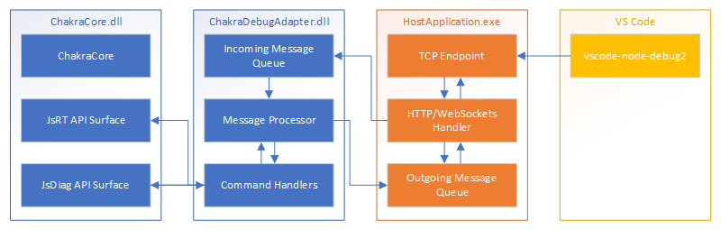

# ChakraCore Debugger Companion

## Overview
There's currently no turn-key way to debug ChakraCore-embedded scenarios.  It's possible to write a debugger using the JsDiag* API surface, but it's non-trivial to leverage any existing debugging tools.  This feature aims to provide an end-to-end flow for debugging the scripts running within ChakraCore in a host application.  The focus is on debugging using VS Code, but since the implementation uses the CrDP protocol it should be compatible with other debuggers as well.

  
*Figure 1: High level overview of the components*

This still doesn't provide a completely turn-key solution but implements all the components which complete the flow while allowing the embedder to customize them as needed for their application.

## Detailed Design
The design consists of two major components, the companion and the platform implementation.  The companion will be used fully, but the platform implementation can be modified or completely reimplemented as required by the needs of the host application.

  
*Figure 2: Sequence of operations for processing a debugger command*

### Threading Model
Debugging operations are all handled on the main engine thread (whichever thread is currently executing the script).  Requests from the frontend are received on a secondary thread which places them into a thread-safe queue and then calls JsRequestAsyncBreak on the engine.  Once the engine has processed the incoming request (generated any outgoing events), they will be placed in a thread-safe outbound queue and the handler will pick them up and send them to the frontend.

  
*Figure 3: Threading model for the components*

### Debugger Companion
The primary job of the companion is to collect messages from the host and process them sequentially.  All messages are in the form of JSON objects and will be placed in a thread-safe queue.

#### Questions

* Multiple companions per Runtime?
  * No, only one can be registered per Runtime.
* Multiple platforms per Companion?
  * No, only one companion is supported at a time
* Multiple frontend connections?
  * Gut instinct says no, the second connection should be rejected
  * I'll need to try this out with node, but I don't see it being necessary unless we get feedback to the contrary

#### API Surface

##### JsErrorCode JsDiagCompanionCreate(JsRuntime runtime, JsDiagCompanion** companion)

Creates a companion instance based on a given runtime.  It also implicitly enables debugging on the given runtime, so it will need to only be done when the engine is not currently running script.  The most straightforward time to initialize is before any code has been run inside the engine, but it's up to the host application to ensure that no code is running before trying to initialize.

* Create an instance of DebuggerCompanion
* Call JsDiagStartDebugging with the companion callback and itself as state

Returns a pointer to the newly created object.

##### JsErrorCode JsDiagCompanionConnect(JsDiagCompanion* companion, bool breakOnNextLine, JsDiagCompanionSendResponseCallback callback, void* state)

Sets up the connection between the companion and platform.  This includes the callback used to send responses and whether to break on the next line after the connection occurs.

The breakOnNextLine boolean causes a flag to be set in the debugger and a call to JsDiagRequestAsyncBreak to be issued.  That call, once fulfilled, will cause the engine to hold in the debugger and continue to pump messages to any connected clients.

##### JsErrorCode JsDiagCompanionSendCommand(JsDiagCompanion* companion, char* command)

Sends a JSON encoded command to the companion.  The command will be processed and send a response asynchronously.

##### JsErrorCode JsDiagCompanionDisconnect(JsDiagCompanion*)

Disconnect the callback and clear any breaks.  It may not make sense as disconnecting and reconnecting is not a core scenario.

##### JsErrorCode JsDiagCompanionDispose(JsDiagCompanion*)

Dispose of the companion:
* Disconnect any listeners
* Call JsDiagStopDebugging to unregister the companion from the engine
* Delete the instance of the companion

This may be able to be combined with the JsDiagCompanionDisconnect function.

#### Dependencies
* Basic synchronization (mutex)

#### Message Processing

All messages within the protocol are in the form of JSON strings.  There are a couple of options for dealing with these strings:
* Use a native JSON parser library (possibly using the C++ REST SDK for this).
* Use ChakraCore to parse/stringify JSON, either from JSRT calls or by running script in a separate context.

The most straightforward approach is to use ChakraCore to do the JSON processing.  The results from the debugger are already JsValueRef pointers anyway, so we can just work directly with them and then stringify the results to get the final response payload.

### Platform Implementation
The platform needs to provide the network connection required for the frontend interface.  The core technologies are HTTP and WebSockets.

#### WebSockets
All inspector traffic is transmitted over WebSockets, with some basic HTTP documents to allow querying the processes state and capabilities.  Although Node.js implements their own WebSockets handshake, for this implementation WebSocket++ looks to be a good library for implementing the same requirements.  It's currently used by the Microsoft C++ REST SDK so there's precedent for its usage.

It depends on an underlying network transport library (their most popular seems to be Asio) to interact with the host operating system, but includes all of the necessary pieces to upgrade an HTTP connection and build/parse the WebSocket frames.

Although it claims to have basic HTTP support, its usage hasn't been investigated for this purpose.  Roughly it looks like it just supports passthrough of HTTP headers for further processing.

#### HTTP

The HTTP endpoint services some basic requests from the frontend:
* /json or /json/list
  * Returns a JSON object containing the debuggable endpoints
* /json/protocol
  * Returns a JSON object containing the current protocol specification
* /json/version
  * Returns a JSON object containing the current "Browser" version and "Protocol-Version"
* /json/activate/\<id\>
  * Unsure what the purpose is, Node.js just seems to return "Target activated" if it's already active or nothing otherwise.

These are basic GET requests and shouldn't require any complex parsing (HTTP headers for instance).  It's not clear if any of these should be forwarded to the companion for responses, at the moment it seems like these are all host-specific (except maybe the protocol).

## Code Layout and Packaging

### Debugger Companion

The debugger companion only uses the public (but still experimental) API surface of ChakraCore.  This allows some flexibility in where the code should live:
* A separate repo which builds against the public interface of ChakraCore as an external dependency.
* As part of the existing ChakraCore repo where it can build against a given version of ChakraCore.

Since the debugger companion will be tightly coupled with the (public, but experimental) interface of ChakraCore, it makes sense for it to live alongside the ChakraCore version for which it was built.  It's beyond the scope of this project to try and support all older versions but going forward we will still want to innovate in the debugger space and will not want to manage these changes externally.
The code for the companion will live inside of ChakraCore and build a LIB (Debugger.Companion.lib) and a DLL (Debugger.Companion.dll).

Paths:
* \<root\>\core\lib\Debugger\Companion\
  * Debugger.Companion.vcxproj
  * DebuggerCompanion.h
  * \<core implementation files\>
* \<root\>\core\bin\Debugger\Companion\Debugger.Companion.vcxproj
  * DebuggerCompanion.def

The primary consumption will be via the DLL which will use only JSRT APIs to interact with the engine.

### Platform Implementation

Because of the third-party dependencies for this part of the code, it likely should not live alongside ChakraCore.

Possible locations:
* Chakra-Samples

### Sample Code

The sample code will combine ChakraCore, ChakraCore.DebuggerCompanion, and ChakraCore.DebuggerPlatform along with a basic code sample which loads JS and executes it.

## Work Items

### Debugger Companion

* Establish project structure and basic build (including cross platform)
* Stub out API interface
* Build processor/dispatcher logic
* Request parsing/response building
* Build command handler logic
  * Runtime
  * Debugger
  * Schema
  * Console
* Write test cases

### Platform Implementation

* Establish project structure and basic build (including cross platform)
* Build the HTTP/WebSockets endpoint
* Build the HTTP request handler code
* Build the Companion interface code
* Write test cases

### Documentation

* Add documentation for the JsDiagCompanion* methods to the ChakraCore wiki
* Add documentation for building the DebuggerPlatform code
* Add documentation for using the DebuggerPlatform code

### Sample Code

* Create project which consumes the dependencies
* Use other samples to create a basic script loader with some rudimentary host functions
* Write test cases for the sample?
* Document the process of building and running the sample
